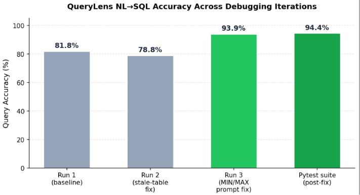

# QueryLens — AI-Powered Natural Language to SQL BI Tool

QueryLens lets you upload any CSV and query it in plain English. It
converts natural-language questions into SQL using an LLM (via Groq),
runs the query safely against an in-memory SQLite database, and
returns results, auto-inferred charts, and the generated SQL for
transparency.

## Features

- **Plain-English querying** — ask "How many students walk to
  school?" and get a direct answer, no SQL knowledge required
- **Schema-aware prompting** — live table schema and sample rows are
  injected into the LLM context so generated SQL matches your actual
  data, not a guess
- **Multi-table CSV ingestion** — upload multiple CSVs, each becomes
  a queryable table with automatic schema inference
- **Read-only SQL validation layer** — enforces single-statement,
  SELECT-only queries and blocks access to SQLite system tables,
  preventing both destructive operations and schema-leak attacks
- **Raw SQL mode** — power users can bypass NL and run validated raw
  SQL directly
- **Auto chart-type inference** — results are rendered as the most
  appropriate chart type based on the data shape
- **Query history** — last 10 queries persisted locally for quick
  re-runs

## Tech Stack

| Layer       | Technology                                  |
|-------------|----------------------------------------------|
| Frontend    | React.js, Vite, Recharts                     |
| Backend     | FastAPI, Python                              |
| Database    | SQLite (per-session, generated from CSVs)    |
| LLM         | Groq API (Llama 3.1 8B Instant)               |
| Testing     | pytest, custom ground-truth accuracy harness |

## Architecture

```
CSV Upload → Schema Extraction → Natural Language Question
                                         ↓
                          Schema + Sample Rows → LLM Prompt
                                         ↓
                              Generated SQL ← Groq API
                                         ↓
                       SQL Validation Layer (read-only,
                       single-statement, no system tables)
                                         ↓
                          SQLite Execution → JSON Result
                                         ↓
                       React Frontend (table + auto chart)
```

## Accuracy Testing

Rather than estimate accuracy informally, QueryLens is validated
against a ground-truth test suite: expected answers are computed
directly from the source CSV using pandas, independent of the
application, then compared against what the NL→SQL pipeline
actually returns.

**Two complementary test layers:**

1. **`test_accuracy.py`** — a 33-question manual test harness
   covering simple lookups, aggregations (COUNT/AVG/MIN/MAX),
   multi-condition filters, GROUP BY queries, and ORDER BY/Top-N
   queries.
2. **`tests/test_querylens_pytest.py`** — an 18-case pytest suite
   covering the same query categories plus dedicated security tests
   verifying that stacked-statement injection and schema-leak
   attempts are rejected.

### Results across debugging iterations



| Run                          | Result    | Accuracy |
|-------------------------------|-----------|----------|
| Run 1 (baseline)              | 27 / 33   | 81.8%    |
| Run 2 (stale-table fix)       | 26 / 33   | 78.8%    |
| Run 3 (MIN/MAX prompt fix)    | 31 / 33   | 93.9%    |
| Pytest suite (post-fix)       | 17 / 18   | 94.4%    |

**What the iterations found and fixed:**

- **Stale-table schema pollution** — a previously uploaded CSV's
  table remained in the database after a new upload, causing the LLM
  to hallucinate unnecessary JOINs against a now-irrelevant table.
  Fixed by ensuring old tables are cleared via the existing
  delete-table endpoint.
- **Aggregate-function misinterpretation** — `MIN`/`MAX` were
  sometimes generated as bare column references (`SELECT MIN FROM
  table`) instead of function calls. Fixed by adding explicit
  function-usage examples to the SQL-generation prompt.
- **LLM non-determinism** — even at `temperature=0`, the same
  question can occasionally produce different SQL across runs (a
  known limitation of LLM-based SQL generation, not unique to this
  project). The dip in Run 2 reflects this variance rather than a
  regression.

Accuracy is reported as a **range (80–94%)** rather than a single
number, since it varies run-to-run due to LLM non-determinism — this
is the honest, measured behavior of the system rather than a
best-case figure.

### Running the tests yourself

```bash
cd backend
pip install -r requirements.txt
pip install pytest requests

# Start the backend in one terminal
uvicorn app.main:app --reload

# In another terminal, run either suite:
python test_accuracy.py        # 33-question manual harness
pytest tests/ -v                # 18-case pytest suite
```

## Security Notes

The SQL validation layer (`app/services/sql_runner.py`) goes beyond
a simple keyword blacklist:

- Rejects multiple stacked statements (`SELECT 1; DROP TABLE x`)
- Enforces that every query starts with `SELECT`
- Blocks direct access to SQLite system tables (`sqlite_master`,
  etc.) that could otherwise leak schema/structure via `UNION SELECT`
- Blocks `PRAGMA`, `ATTACH`, and `DETACH` in addition to standard
  destructive keywords

This is documented as **defense-in-depth, not a complete guarantee**
— it remains string-based validation rather than a full SQL parser,
and the appropriate production boundary is that this API should only
ever operate on disposable, per-session data rather than a database
containing sensitive information.

## Dataset

The sample dataset (`student_score.csv`) used for testing is sourced
from Kaggle and distributed under the Apache 2.0 License. Any CSV
can be substituted — the schema-extraction and prompting pipeline is
dataset-agnostic.

## Setup

### Backend

```bash
cd backend
python -m venv venv
source venv/bin/activate   # Windows: venv\Scripts\activate
pip install -r requirements.txt
```

Create a `.env` file in `backend/`:

```
GROQ_API_KEY=your_key_here
GROQ_API_URL=https://api.groq.com/openai/v1/chat/completions
```

```bash
uvicorn app.main:app --reload
```

### Frontend

```bash
cd frontend
npm install
npm run dev
```

## Deployment

- **Backend** — deployed via Docker on Hugging Face Spaces
- **Frontend** — deployed on Vercel, configured with `VITE_API_URL`
  pointing to the deployed backend

## Known Limitations

- LLM-based SQL generation is non-deterministic; the same question
  can occasionally produce different (and sometimes invalid) SQL
  across runs
- GROUP BY queries sometimes omit the grouping column from the
  SELECT clause, producing an aggregate value without its label
- The SQL validation layer is string-based, not a full SQL parser —
  suitable as defense-in-depth for a disposable per-session
  database, not as a standalone guarantee for production systems
  handling sensitive data
